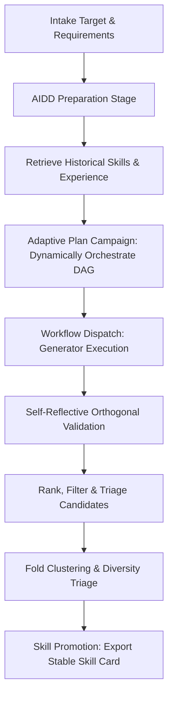
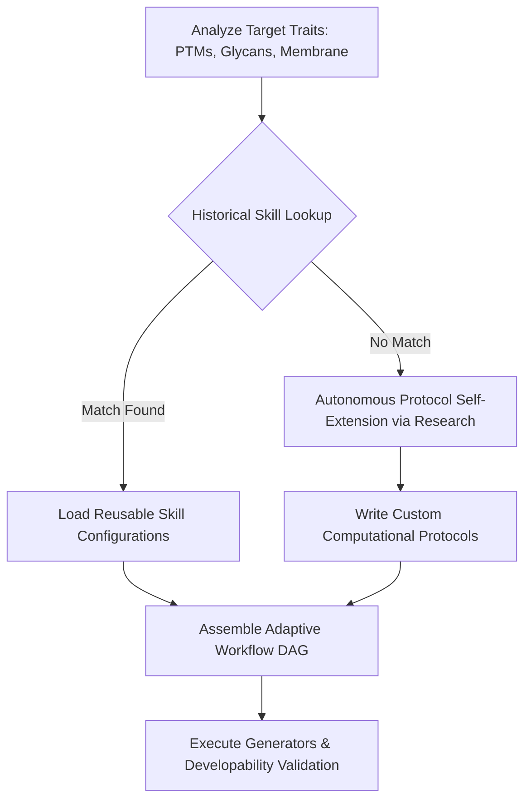

# AIDD Binder Workflow Guide

Last reviewed: 2026-05-21
Version: 4.0.0 (Hermes-Style Autonomous Orchestration)

## Purpose

The AIDD binder workflow is the narrow first product surface for AIDD-Intern: *de novo* binder design for AIDD targets, currently focused on protein binder campaigns. It follows three core design constraints:

- Keep the generic agent runtime reusable;
- Expose mature biology and design engines through declarative tools and Model Context Protocol (MCP);
- Make every final binder recommendation traceable to requirements, evidence, filters, and residual risks.

The generic runtime remains a durable tool-using harness with persistent session traces, MCP integration, and clear planning loops. By adopting **NousResearch Hermes Agent** design philosophy, the AIDD-specific layer **avoids any rigid, hard-coded rules or decision matrices**. Instead, the Agent operates with complete runtime self-reflection, dynamically determining optimal workflows and selecting generative/validation models based on prior runs, exported skill memories, and empirical evidence.

---

## Default Campaign Loop

The AIDD campaign runs in an adaptive, closed-loop pipeline where the Agent possesses full workflow self-governance:



1. **Intake**: Gather target PDB, chain(s), biological assembly, epitope/hotspots, no-go regions, binder length, assay, and developability constraints.
2. **Research & Prep**: Retrieve structures, homology maps, PTM notes, and PDB metadata using `aidd_bio` and targeted search.
3. **Experience Matching**: Scan previous session logs and the local `skills/` repository to retrieve optimal modeling configurations for similar target families or folding topologies.
4. **Adaptive Plan**: Call `binder_design(operation="plan_campaign")` to dynamically design a task execution plan, establishing appropriate risk registers and routing conditions tailored to the target's complex boundaries.
5. **Flexible Execution**: Automatically configure and dispatch generation tasks across available structural engines: **RFdiffusion3 (RFD3)**, **PXDesign**, **BoltzGen**, or **BindCraft**.
6. **Self-Reflective Validation**: Query independent complex predictors (e.g., **Chai-1**, **Protenix**, or **AlphaFold3**) to calculate interface parameters and check for reward-hacking biases.
7. **Rank & Triage**: Call `binder_design(operation="rank_candidates")` to run multi-objective scoring and dynamically determine which structures pass to wet-lab, which are held for further orthogonal cross-checks, and which are rejected.
8. **Diversification**: Cluster binders via Foldseek or TM-align to maintain high-diversity representatives.
9. **Skill Promotion**: Call `binder_design(operation="export_skill")` to lock down successful configurations as durable Markdown skill cards under `skills/`, promoting workspace intelligence over time.

---

## 1. Binder Design 核心模型配置规范 (Model Configurations)

To support autonomous setup and model execution, the standard configuration parameters and compute specifications for our primary generative models are structured as follows:

### 1.1 RFdiffusion3 (RFD3) 全原子扩散生成器
*   **Overview**: An advanced all-atom diffusion model that operates with atom-level precision rather than residue-level simplifications. It allows defining specific atomic interactions (e.g., precise hydrogen bonding to a particular target oxygen atom) and features 10x faster inference speed compared to RFdiffusion2.
*   **Compute Requirements**: NVIDIA A100/H100 (>= 24GB VRAM) for heavy atom-graph transformer calculations.
*   **Configuration Template (`rfd3_config.json`)**:
    ```json
    {
      "model": "RFdiffusion3-AllAtom",
      "inference": {
        "num_designs": 100,
        "speedup_factor": 10.0,
        "all_atom_mode": true
      },
      "conditioning": {
        "target_pdb": "runs/pd-l1-prep/pd_l1_cropped.pdb",
        "target_chains": ["A"],
        "hotspots": [
          {"residue": "Y56", "chain": "A", "atom": "OH", "constraint_type": "hydrogen_bond"},
          {"residue": "M115", "chain": "A", "atom": "SD", "constraint_type": "hydrophobic_contact"}
        ]
      },
      "scaffold": {
        "binder_length_range": [70, 130],
        "solvent_accessibility_bias": 0.4
      }
    }
    ```

### 1.2 PXDesign 骨架与序列高通量生成器
*   **Overview**: Highly efficient backbone searching and high-throughput sequence prediction for mapping diverse starting binders.
*   **Compute Requirements**: Standard NVIDIA T4 / RTX 4090.
*   **Configuration Template (`pxdesign_config.json`)**:
    ```json
    {
      "model": "PXDesign-V2",
      "generation": {
        "backbones_to_generate": 1000,
        "sequences_per_backbone": 5,
        "temperature": 0.2
      },
      "scaffold_type": "helical_bundle",
      "interface": {
        "target_chain": "A",
        "anchor_residues": [56, 115]
      }
    }
    ```

### 1.3 BoltzGen 靶点约束引导生成器
*   **Overview**: Constraint-conditioned binder generation guided by pocket microenvironments or custom geometries.
*   **Configuration Template (`boltzgen_config.json`)**:
    ```json
    {
      "model": "BoltzGen-1.0",
      "conditioning_strength": 0.85,
      "requirements": {
        "target_structure": "runs/pd-l1-prep/pd_l1_cropped.pdb",
        "target_epitope_residues": [19, 56, 68, 115]
      }
    }
    ```

### 1.4 BindCraft 柔性全自动反向折叠器
*   **Overview**: Utilizes AlphaFold2 gradients to co-evolve target backbones and binder sequences simultaneously, ideal for highly flexible target loops or complex binding vectors.
*   **Compute Requirements**: NVIDIA >= 40GB VRAM (A100 Recommended).
*   **Configuration Template (`bindcraft_config.json`)**:
    ```json
    {
      "model": "BindCraft-AF2-Multimer",
      "cycles": {
        "num_hallucination_cycles": 5,
        "mpnn_design_runs": 10,
        "af2_repredicts": 3
      },
      "target": {
        "pdb_path": "runs/pd-l1-prep/pd_l1_cropped.pdb",
        "flexible_backbone": true
      },
      "seq_design": {
        "tool": "ProteinMPNN",
        "fixed_interface_residues_cutoff_angstrom": 4.0
      }
    }
    ```

---

## 2. 自主经验学习与 Latent-Y 协议自进化 (Autonomous Learning & Protocol Self-Extension)

Unlike rigid traditional frameworks that rely on hard-coded decision tables or fixed scoring arithmetic, **AIDD-Intern follows a dynamically orchestrated design philosophy modeled after Latent-Y (arXiv:2603.29727)**. The Agent operates with runtime freedom to analyze target traits, lookup historical benchmarks, and compile the most appropriate generator DAG.



### 2.1 协议自我进化延伸 (Protocol Self-Extension Mechanism)
When encountering a completely novel target class (e.g., non-standard lipids, unique post-translational modifications like phosphorylation, or non-natural amino acids), the Agent is not constrained by static local configurations:
1. **Parallel Research**: It launches the `research` tool to crawl bioRxiv, PubMed, and Europe PMC. It bypasses abstract-level summaries to extract exact computational recipes and molecular dynamics parameter files from peer-reviewed Methodology sections.
2. **Custom Script Execution**: It dynamically compiles the retrieved physics constraints into custom configuration patches (e.g., configuring RFdiffusion3 atomic bonding guidelines or setting custom ProteinMPNN temperature profiles).
3. **Durable Promotion**: After verifying the campaign's success, the Agent calls `binder_design(operation="export_skill")` to promote the generated workspace logs and novel constraints into a file-backed Skill Card under `skills/`, extending its biological capability boundary for future zero-shot runs.

---

## 3. 可转向人机协同机制 (Steerable Human-in-the-Loop Options)

Following the steerable design of Latent-Y, the Agent does not operate in a black box. If target biological boundaries are highly ambiguous or underspecified, the Agent halts the autonomous pipeline to present structured 「Strategic Design Options」 inside the TUI display.

### 3.1 HITL Steering Decision Gates
During intake, if any of the following triggers are met:
- **PTM & Glycan Ambiguity**: Active site close to heavy N-glycosylation.
- **Epitope Multiplicity**: Multiple hotspot residues scattered across different domains without a defined priority chain.
- **Membrane Proximity**: Structural risk of steric overlap with lipid bilayers.

The Agent intercepts the execution flow and renders the following decision steering prompt on the terminal:

```
[STEERING INTERCEPTED] The target PDB contains complex steric boundaries. Please select a design topology:

Option 1: Rigid Cavity Locking (High Affinity focus)
  - Workflow: RFdiffusion3 (All-Atom) + ProteinMPNN + AlphaFold3
  - Constraints: Precise atom-level hydrogen bonds targeting Tyr-56/Met-115
  - Est. Compute: ~2.5h (A100 GPU) | Success Prob: ~70% | Risk: Potential steric clash with glycan shield at Asn-62

Option 2: Flexible Vector Hallucination (Hinge Tolerance focus)
  - Workflow: BindCraft (AF2-Multimer) + ProteinMPNN + Chai-1
  - Constraints: Flexible backbone sampling around pocket interface
  - Est. Compute: ~4.0h (A100 GPU) | Success Prob: ~65% | Risk: High aggregation propensity due to hydrophobic core exposure

Option 3: High-Throughput Backbone Sieve (Speed & Diversity focus)
  - Workflow: PXDesign + BoltzGen + Protenix
  - Constraints: HELIX scaffold bundle search with 1000 generated sequences
  - Est. Compute: ~0.8h (RTX 4090 GPU) | Success Prob: ~50% | Risk: Slightly lower predicted binding affinity (iPAE > 6)

>>> Please enter your steering command (e.g., "Choose Option 1 but prioritize Tyr-56 hydrogen bonds, relax constraints for Tyr-62"):
```

The researcher’s text input is parsed in the runtime loop, instantly rewriting the campaign project manifest and steering the downstream generative model execution DAG dynamically.

---

## 4. 成药性感知验证与自校准门禁 (Developability-Aware Triage & Self-Calibration)

To ensure generated binders are fit for in-vitro synthesis ("lab-ready sequences"), candidate designs must pass through both independent structural validation (Chai-1, Protenix, AlphaFold3) AND developability assessment:

### 4.1 Developability-Aware Physical Gates
Rather than evaluating structural affinity alone, the Agent integrates physicochemical developability metrics into candidate screening:

| Category | Metric | Biological Constraint | Physical Triage Threshold | Action on Failure |
| :--- | :--- | :--- | :--- | :--- |
| **Affinity** | `pLDDT` | Structural self-folding | Standard: $\ge 80$ \| Strict: $\ge 85$ | Reject (unfolded backbone) |
| **Affinity** | `ipTM` | Interface predicted TM | Standard: $\ge 0.75$ \| Strict: $\ge 0.80$ | Hold (needs orthogonal verification) |
| **Affinity** | `iPAE` | Interface alignment error | Standard: $\le 8$ Å \| Strict: $\le 5$ Å | Tighten to ensure interface rigidity |
| **Developability** | `hydrophobic_sasa` | Surface hydrophobic patch size | Ratio of hydrophobic to total area $\le 0.35$ | Reject (prone to off-target aggregation) |
| **Developability** | `aggregation_score` | Self-aggregation propensity | Aggregation scale index $\le 1.5$ | Triage (requires loop optimization) |
| **Developability** | `clashes` | Steric overlaps | Zero-clash ($= 0$) | Absolute physical filter (Reject) |
| **Developability** | `rmsd` | Backbone displacement vs scaffold | $\le 2.5$ Å | Reject (scaffold deformation) |

### 4.2 Self-Calibrating Triage
In a design batch, folding confidences can exhibit high variability depending on target surface topologies. The Agent autonomously runs statistical self-calibration on the batch:
- **Strict Shift**: If over 50% of candidates easily pass the standard gate, the Agent dynamically shifts triage thresholds to the **Strict Gate** to sieve the absolute elite candidates for the wet-lab dossier.
- **Relaxation with Risks**: If zero candidates pass standard affinity due to high target flexibility, the Agent self-corrects: it relaxes structural affinity by 5% but strictly maintains developability metrics (clashes = 0, hydrophobic SASA <= 0.35), noting this trade-off in the final risk register.

---

## 5. 历史记忆与技能卡片编排 (History-Driven Workflow & Skill Cards)

The ultimate evolution of the design loop is **Skill Promotion**. Once a complex target-binder pipeline achieves highly validated outputs, the Agent promotes the session log into a structured skill card:

```bash
aidd-intern --export-skill \
  --project-dir runs/pd-l1-campaign \
  --skill-name "pd1_binder_campaign"
```

This lockable Markdown card (`skills/pd1_binder_campaign.md`) preserves:
1. Target biological baseline and cropped structural inputs;
2. Autonomously formulated model combinations and dynamic DAG pathways (including custom protocols generated via Self-Extension);
3. Verified triage gate filters and resolved risk strategies.

For future runs on homologous targets, the Agent bypasses de-novo trial-and-error, loading this promoted card as an empirical blueprint. This enables high-efficiency, zero-shot, reproducible binder design campaigns.

---

## Verification & QA

To verify that the binder design tool and its dynamic campaign planner operate correctly and conform to runtime schemas, execute:

```bash
uv run pytest tests/unit/test_binder_design_tool.py
uv run pytest tests/unit/test_protein_design_workflow.py
```
