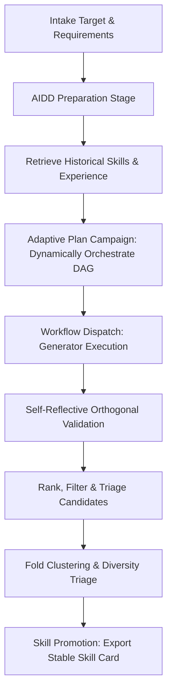
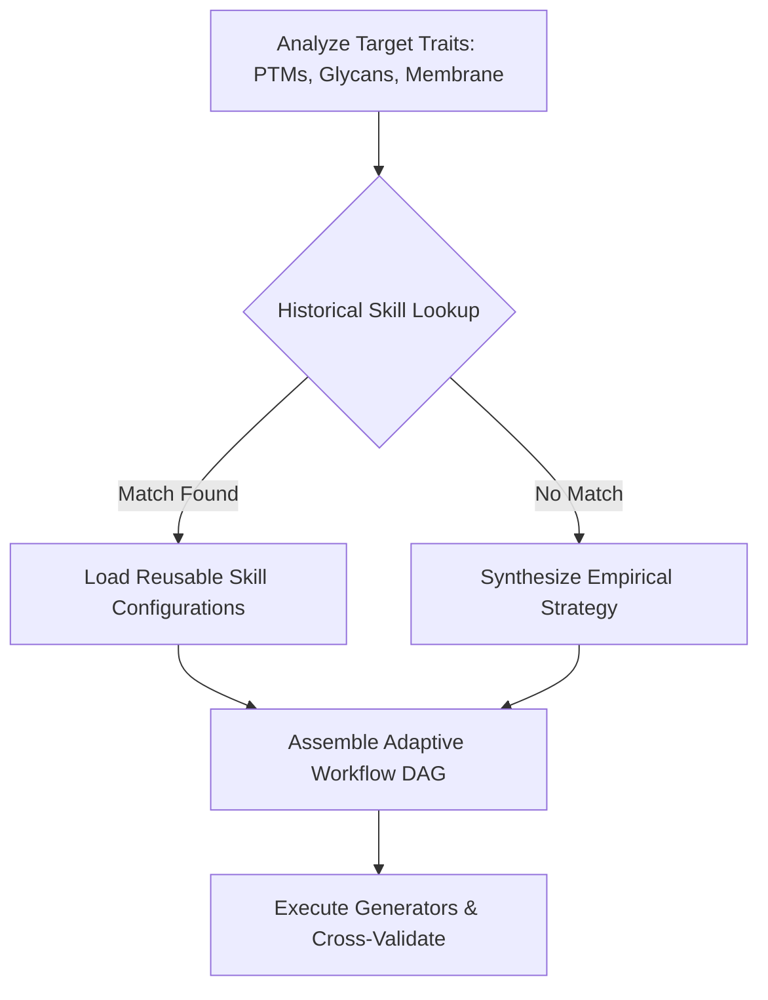

# AIDD Binder Workflow Guide

Last reviewed: 2026-05-21
Version: 4.0.0 (Hermes-Style Autonomous Orchestration)

## Purpose

The AIDD binder workflow is the narrow first product surface for AIDD-Intern: *de novo* binder design for AIDD targets, currently focused on protein binder campaigns. It follows three core design constraints:

- Keep the generic agent runtime reusable;
- Expose mature biology and design engines through declarative tools and Model Context Protocol (MCP);
- Make every final binder recommendation traceable to requirements, evidence, filters, and residual risks.

The generic runtime remains a durable tool-using harness with persistent session traces, MCP integration, and clear planning loops. By adopting **NousResearch Hermes Agent** design philosophy, the AIDD-specific layer **avoids any rigid, hard-coded rules or decision matrices**. Instead, the Agent operates with complete runtime self-reflection, dynamically determining optimal workflows and selecting generative/validation models based on prior runs, exported skill memories, and empirical evidence.

---

## Default Campaign Loop

The AIDD campaign runs in an adaptive, closed-loop pipeline where the Agent possesses full workflow self-governance:



1. **Intake**: Gather target PDB, chain(s), biological assembly, epitope/hotspots, no-go regions, binder length, assay, and developability constraints.
2. **Research & Prep**: Retrieve structures, homology maps, PTM notes, and PDB metadata using `aidd_bio` and targeted search.
3. **Experience Matching**: Scan previous session logs and the local `skills/` repository to retrieve optimal modeling configurations for similar target families or folding topologies.
4. **Adaptive Plan**: Call `binder_design(operation="plan_campaign")` to dynamically design a task execution plan, establishing appropriate risk registers and routing conditions tailored to the target's complex boundaries.
5. **Flexible Execution**: Automatically configure and dispatch generation tasks across available structural engines: **RFdiffusion3 (RFD3)**, **PXDesign**, **BoltzGen**, or **BindCraft**.
6. **Self-Reflective Validation**: Query independent complex predictors (e.g., **Chai-1**, **Protenix**, or **AlphaFold3**) to calculate interface parameters and check for reward-hacking biases.
7. **Rank & Triage**: Call `binder_design(operation="rank_candidates")` to run multi-objective scoring and dynamically determine which structures pass to wet-lab, which are held for further orthogonal cross-checks, and which are rejected.
8. **Diversification**: Cluster binders via Foldseek or TM-align to maintain high-diversity representatives.
9. **Skill Promotion**: Call `binder_design(operation="export_skill")` to lock down successful configurations as durable Markdown skill cards under `skills/`, promoting workspace intelligence over time.

---

## 1. Binder Design 核心模型配置规范 (Model Configurations)

To support autonomous setup and model execution, the standard configuration parameters and compute specifications for our primary generative models are structured as follows:

### 1.1 RFdiffusion3 (RFD3) 全原子扩散生成器
*   **Overview**: An advanced all-atom diffusion model that operates with atom-level precision rather than residue-level simplifications. It allows defining specific atomic interactions (e.g., precise hydrogen bonding to a particular target oxygen atom) and features 10x faster inference speed compared to RFdiffusion2.
*   **Compute Requirements**: NVIDIA A100/H100 (>= 24GB VRAM) for heavy atom-graph transformer calculations.
*   **Configuration Template (`rfd3_config.json`)**:
    ```json
    {
      "model": "RFdiffusion3-AllAtom",
      "inference": {
        "num_designs": 100,
        "speedup_factor": 10.0,
        "all_atom_mode": true
      },
      "conditioning": {
        "target_pdb": "runs/pd-l1-prep/pd_l1_cropped.pdb",
        "target_chains": ["A"],
        "hotspots": [
          {"residue": "Y56", "chain": "A", "atom": "OH", "constraint_type": "hydrogen_bond"},
          {"residue": "M115", "chain": "A", "atom": "SD", "constraint_type": "hydrophobic_contact"}
        ]
      },
      "scaffold": {
        "binder_length_range": [70, 130],
        "solvent_accessibility_bias": 0.4
      }
    }
    ```

### 1.2 PXDesign 骨架与序列高通量生成器
*   **Overview**: Highly efficient backbone searching and high-throughput sequence prediction for mapping diverse starting binders.
*   **Compute Requirements**: Standard NVIDIA T4 / RTX 4090.
*   **Configuration Template (`pxdesign_config.json`)**:
    ```json
    {
      "model": "PXDesign-V2",
      "generation": {
        "backbones_to_generate": 1000,
        "sequences_per_backbone": 5,
        "temperature": 0.2
      },
      "scaffold_type": "helical_bundle",
      "interface": {
        "target_chain": "A",
        "anchor_residues": [56, 115]
      }
    }
    ```

### 1.3 BoltzGen 靶点约束引导生成器
*   **Overview**: Constraint-conditioned binder generation guided by pocket microenvironments or custom geometries.
*   **Configuration Template (`boltzgen_config.json`)**:
    ```json
    {
      "model": "BoltzGen-1.0",
      "conditioning_strength": 0.85,
      "requirements": {
        "target_structure": "runs/pd-l1-prep/pd_l1_cropped.pdb",
        "target_epitope_residues": [19, 56, 68, 115]
      }
    }
    ```

### 1.4 BindCraft 柔性全自动反向折叠器
*   **Overview**: Utilizes AlphaFold2 gradients to co-evolve target backbones and binder sequences simultaneously, ideal for highly flexible target loops or complex binding vectors.
*   **Compute Requirements**: NVIDIA >= 40GB VRAM (A100 Recommended).
*   **Configuration Template (`bindcraft_config.json`)**:
    ```json
    {
      "model": "BindCraft-AF2-Multimer",
      "cycles": {
        "num_hallucination_cycles": 5,
        "mpnn_design_runs": 10,
        "af2_repredicts": 3
      },
      "target": {
        "pdb_path": "runs/pd-l1-prep/pd_l1_cropped.pdb",
        "flexible_backbone": true
      },
      "seq_design": {
        "tool": "ProteinMPNN",
        "fixed_interface_residues_cutoff_angstrom": 4.0
      }
    }
    ```

---

## 2. 自主经验学习与弹性模型编排 (Autonomous Experience-Driven Model Selection)

Unlike rigid traditional frameworks that rely on hard-coded decision tables or fixed scoring arithmetic, **AIDD-Intern follows a dynamically orchestrated design philosophy**. The Agent operates with runtime freedom to analyze target traits, lookup historical benchmarks, and compile the most appropriate generator DAG.



### 2.1 零写死规则决策机制 (Zero Hard-Coded Decisions)
During the campaign intake and planning stages:
1. **Target Complexity Analysis**: The Agent analyzes biological barriers such as steric glycan shielding, membrane proximity, species variable residues, and fold complexity.
2. **Prior Runs & Skill Lookup**: The Agent queries local `skills/*.md` files and workspace logs. For example, if a past campaign against a membrane-bound protein successfully used a specific **RFdiffusion3 + ProteinMPNN** sequence combination and achieved high in-vitro hit rates, the Agent will prioritize that combination over standard backprop hallucination.
3. **Adaptive Workflow Composition (Dynamic DAG)**:
   - Instead of applying static mapping rules, the Agent dynamically coordinates the execution flow:
     - For standard, high-throughput campaigns, it may opt for an agile **PXDesign + BoltzGen** search pipeline.
     - For targets requiring flexible hinge conformation, it autonomously delegates task steps to **BindCraft**.
     - When precise, atom-level hydrogen bonds are requested, it dynamically routes the process to **RFdiffusion3 (All-Atom) + ProteinMPNN + AlphaFold3**, bypassing standard design paths.

This paradigm ensures the system remains completely flexible, evolving its orchestration heuristics continuously as new structural design paradigms emerge.

---

## 3. 正交验证与自适应过滤决策流程 (Orthogonal Validation & Self-Reflective Triage)

To protect the campaign against single-model over-fitting (reward hacking), candidate designs must pass through independent validation gates.

### 3.1 互锁交叉验证 (Interlocking Validation Gates)
Designs generated by RFD3, BindCraft, or PXDesign are dynamically routed to independent complex structure predictors: **Chai-1**, **Protenix**, or **AlphaFold3 (AF3)**.

### 3.2 自适应过滤阈值 (Self-Calibrating Triage Gates)
Rather than locking threshold parameters, the Agent is encouraged to autonomously calibrate gate parameters based on the observed distribution of folding confidences across the design batch:

| Metric | Physical Metric | Baseline standard Gate | Adaptive Strict Gate | Self-Reflection Adjustment |
| :--- | :--- | :--- | :--- | :--- |
| **pLDDT** | Self-folding confidence | $\ge 80$ | $\ge 85$ | Auto-raise if global designs fold highly stably |
| **ipTM** | Interface predicted TM | $\ge 0.75$ | $\ge 0.80$ | Auto-raise if binding interface forms easily |
| **iPAE** | Interface alignment error | $\le 8$ Å | $\le 5$ Å | Tighten dynamically to ensure rigid interface locking |
| **Clashes** | Atomic steric overlap | $= 0$ | $= 0$ | Absolute physical filter |
| **RMSD** | Displacement vs scaffold | $\le 3.0$ Å | $\le 2.5$ Å | Dynamic window adjustment based on flexible regions |

### 3.3 Dynamic Decision Routing
Based on candidate triage, the Agent executes the following routing logic:
- **`advance`**: Passes all strict thresholds and independent orthogonal validations. The candidate is immediately queued for wet-lab synthesis.
- **`hold_for_orthogonal_validation`**: Has strong generator-specific scores but lacks independent folding confirmation. The Agent automatically schedules background validation tasks using Chai-1 or Protenix.
- **`reject`**: Fails baseline criteria and is discarded to preserve budget.

---

## 4. 历史记忆与技能卡片编排 (History-Driven Workflow & Skill Cards)

The ultimate evolution of the Hermes-style design loop is **Skill Promotion**. Once a complex target-binder pipeline achieves highly validated outputs, the Agent promotes the session log into a structured skill card:

```bash
aidd-intern --export-skill \
  --project-dir runs/pd-l1-campaign \
  --skill-name "pd1_binder_campaign"
```

This lockable Markdown card (`skills/pd1_binder_campaign.md`) preserves:
1. Target biological baseline and cropped structural inputs;
2. Autonomously formulated model combinations and dynamic DAG pathways;
3. Verified triage gate filters and resolved risk strategies.

For future runs on homologous targets, the Agent bypasses de-novo trial-and-error, loading this promoted card as an empirical blueprint. This enables high-efficiency, zero-shot, reproducible binder design campaigns.

---

## Verification & QA

To verify that the binder design tool and its dynamic campaign planner operate correctly and conform to runtime schemas, execute:

```bash
uv run pytest tests/unit/test_binder_design_tool.py
uv run pytest tests/unit/test_protein_design_workflow.py
```
